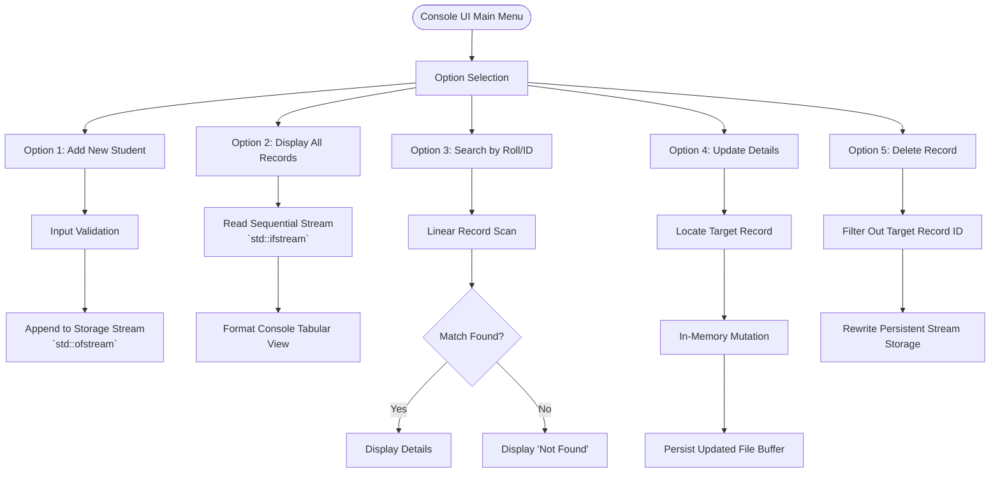

# Student Management System (C++)


## Executive Overview
Information system backends fundamentally rely on the seamless execution of Create, Read, Update, and Delete (CRUD) operations linked to non-volatile storage. This project serves as a foundational C++ **Database Management System (DBMS)** for student records. It bypasses heavy relational engines (like SQL) in favor of raw `<fstream>` serialization, demonstrating low-level command over memory boundaries, structured record layouts, and persistent stream writing.

> [!CAUTION]
> **Software Reliability & Data Integrity Callout**
> Raw file streaming is susceptible to catastrophic data corruption if an application crashes mid-write. Careful stream flushing and closure are required. Furthermore, when combining mixed `std::cin` extractions (integers) alongside `std::getline` (strings), trailing newline characters `\n` left in the input buffer can cause silent skipping of subsequent inputs. Robust console applications must aggressively clear input streams utilizing `std::cin.ignore()` and handle type-mismatch failures using `std::cin.fail()`.

## System Highlights
- **Complete CRUD Data Lifecycle**: Full implementation of record insertion, retrieval, modification, and deletion.
- **Persistent Storage Serialization**: Reads and writes C++ structured objects (`struct` / `class`) directly to non-volatile disk files using `std::ifstream` and `std::ofstream`.
- **Primary Key Linear Search**: Implements robust string-matching algorithms to locate specific records based on unique identifiers (Roll Numbers/IDs).
- **In-Place Field Updates**: Logic allowing targeted modification of a student's attributes without destroying unaffected records.

## Software Architecture Flowchart



## Algorithmic & Complexity Models

### Operations Time Complexity Matrix
Operating on raw sequential text/binary files without indexing necessitates distinct processing complexities:
- **Insert Record (Append Mode `ios::app`)**: $\mathcal{O}(1)$ — Immediate write to EOF.
- **Search Record by Primary Key**: $\mathcal{O}(N)$ — Sequential scan requiring up to $N$ disk reads.
- **Modify / Delete Record**: $\mathcal{O}(N)$ — Requires scanning $N$ records, mutating/filtering in memory, and executing a complete file rewrite.
- **Display All Records**: $\mathcal{O}(N)$ — $N$ disk reads and $N$ console render cycles.

### Memory & Storage Space Complexity
By buffering records sequentially, the heap memory required remains independent of the database size:
$$\text{Auxiliary Memory Space: } \mathcal{O}(1) \quad (\text{Direct stream record-by-record processing})$$
$$\text{Disk File Footprint: } \text{Size} \approx N \times \text{sizeof}(\text{StudentRecord})$$

### Record File Offset Calculation
If the database transitions from text parsing to fixed-width binary serialization, $\mathcal{O}(1)$ record access can be achieved via stream offsets:
$$\text{Byte Offset}(i) = i \times \text{sizeof}(\text{StudentRecord})$$

## Build & Compilation Matrix
To compile this project natively via a MinGW/GCC toolchain:

```bash
g++ -O2 "src/PROJECT OF A STUDENT SYSTEM IN C++ .cxx" -o bin/student_system.exe
```

## Repository Layout Tree
```text
📦 Student Management System
 ┣ 📂 src/             # Core C++ application source code
 ┃ ┗ 📜 PROJECT OF A STUDENT SYSTEM IN C++ .cxx
 ┣ 📂 docs/            # Engineering documentation & flowcharts
 ┃ ┣ 📂 images/        # [ORIGINAL CONSOLE UI ARTIFACTS]
 ┃ ┃ ┗ 📜 screenshot.png
 ┃ ┣ 📜 Student System In C++ ??? ????.pdf
 ┃ ┗ 📜 project of a students system.html
 ┣ 📂 bin/             # Compiled executable binaries (Ignored)
 ┣ 📜 README.md        # This document
 ┣ 📜 LICENSE          # MIT License
 ┗ 📜 .gitignore       # Build artifact and local database exclusions
```

## Authentic Artifacts Catalog
- **Source Code Implementation**: Available directly within [`src/`](src/).
- **Original Reports & Architecture Files**: Retained as historical references in [`docs/`](docs/).
- **Application Execution Captures**: Console UI logs are verified in [`docs/images/`](docs/images/).

## Engineering Audit & Tradeoffs
- **Flat File Storage vs. RDBMS**: Flat files (`.txt` / `.dat`) are excellent for minimal dependencies on embedded constraints. However, as $N$ scales, the $\mathcal{O}(N)$ cost of modifying a single record becomes untenable, mandating a transition to Relational Database Management Systems (RDBMS) like SQLite or PostgreSQL for B-Tree indexing and atomic ACID compliance.
- **In-Memory Arrays vs. Disk-Backed Streaming**: Loading the entire file into a `std::vector` upon startup accelerates search queries to $\mathcal{O}(1)$ (via hash maps), but risks `std::bad_alloc` exceptions if the database size exceeds available physical RAM.

---

**Hassan Moqbel Morshed Ghaleb**
Mechatronics Engineer | Mechanical Design & CAD (SolidWorks & AutoCAD) | Preventive Maintenance & Electromechanical Systems | Industrial Automation, Control Systems, Robotics & Intelligent Machines | CAD/FEA, Embedded Systems, Python & C++
[GitHub](https://github.com/Hassan-Moqbel) · [Facebook](https://www.facebook.com/share/1BqxAgVjHi/) · [LinkedIn](https://www.linkedin.com/in/hassan-moqbel)

## License
This project is licensed under the [MIT License](LICENSE).
